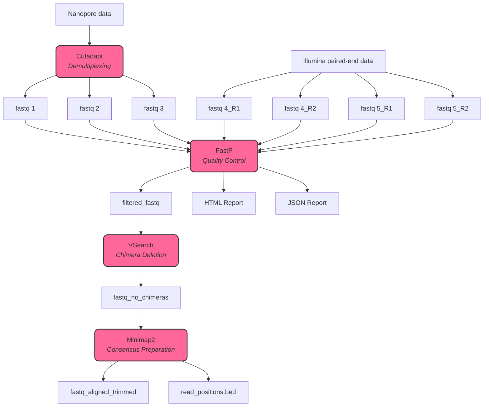

# Pipeline_4

## Overview

This pipeline is designed for processing sequencing data from Illumina and Nanopore platforms, specifically for pathogen detection using the **pathogen detection kit based on probes from Science and Business**. It provides a streamlined workflow for data demultiplexing, quality control, chimera detection, and dereplication of sequencing reads (for now :D).

## Table of Contents

- [Pipeline Structure](#pipeline-structure)
- [Requirements](#requirements)
- [Workflow](#workflow)
- [Rules Description](#rules-description)
- [Configuration](#configuration)
- [Config File](#config-file)
- [Usage](#usage)
- [Output](#output)

## Pipeline Structure




The pipeline consists of several interconnected rules that handle different stages of the data processing workflow:

1. **Demultiplexing**: Using Cutadapt to trim and demultiplex the reads.
2. **Quality Control and Filtering**: Applying Fastp for quality control, filtering, and report generation.
3. **Chimera Detection and Dereplication**: Utilizing VSEARCH to detect chimeras and dereplicate sequences.

## Requirements

- [Python 3.12.6](https://www.python.org/downloads/release/python-3126/)
- [Snakemake](https://snakemake.readthedocs.io/en/stable/)
- [Conda](https://docs.conda.io/projects/conda/en/latest/user-guide/install/index.html)
- [Cutadapt](https://cutadapt.readthedocs.io/en/stable/)
- [Fastp](https://github.com/OpenGene/fastp)
- [VSEARCH](https://github.com/torognes/vsearch)
- [Minimap2](https://github.com/lh3/minimap2)
- [Samtools](http://www.htslib.org/)
- [Bedtools](https://bedtools.readthedocs.io/en/latest/)
- [Spades](https://github.com/ablab/spades) 
- [Swarm](https://github.com/torognes/swarm)


## Workflow

The workflow is divided into several stages, each implemented as a rule in the Snakemake pipeline. The rules are executed in sequence, with the output of one rule serving as the input for the next.

## Rules Description

### 1. Cutadapt

- **Function**: Trim adapters from reads and demultiplex the data.
- **Input**: Raw FASTQ files.
- **Output**: Trimmed FASTQ files (fastq1, fastq2, fastq3).

---

### 2. Fastp

- **Function**: Perform quality control on the trimmed reads, including filtering based on quality scores and generating reports.
- **Input**: Trimmed FASTQ files from Cutadapt.
- **Output**: 
  - Filtered FASTQ files (filtered_fastq).
  - Quality reports (HTML and JSON).

---

### 3. VSEARCH

- **Function**: Detect chimeras in the filtered sequences and dereplicate them.
- **Input**: Filtered FASTQ files from Fastp.
- **Output**: 
  - Non-chimeric FASTQ files (fastq_no_chimeras).
  - Dereplicated sequences.

---

### 4. Minimap2

- **Function**: Align the non-chimeric reads and prepare for consensus generation.
- **Input**: The fastq file with no chimeras.
- **Output**: 
  - Aligned FASTQ files (fastq_aligned_trimmed).
  - Read position information (read_positions.bed).

## Configuration

The pipeline's parameters can be configured in the `config.yaml` file. Key parameters include:

### Config File

The configuration file requires the following structure to define input and output directories, logging, and result paths, as well as analysis parameters such as sequencing type and k-mer reference database.

```bash
general:
  input_dir: /mnt/lustre/scratch/nlsas/home/uvi/bg/sbg/pipelines/test_pipeline4/data
  output_dir: /mnt/lustre/scratch/nlsas/home/uvi/bg/sbg/pipelines/test_pipeline4/output
  scripts_dir: /mnt/lustre/scratch/nlsas/home/uvi/bg/sbg/pipelines/Pipeline_4/scripts
  logs_dir: /mnt/lustre/scratch/nlsas/home/uvi/bg/sbg/pipelines/test_pipeline4/logs
  results: /mnt/lustre/scratch/nlsas/home/uvi/bg/sbg/pipelines/test_pipeline4/results

params:
  seq: "single-end"  # or "paired-end"
  win_size: 4
  mean_qual: 7
  ref_database: /mnt/lustre/scratch/nlsas/home/uvi/bg/sbg/pipelines/Pipeline_4/database.db
```
### Key Parameters

- **input_dir**: Directory containing the input sequencing data.
- **output_dir**: Directory where the output files will be generated.
- **scripts_dir**: Directory containing the scripts used in the pipeline.
- **logs_dir**: Directory for storing log files generated during the pipeline execution.
- **results**: Directory for storing the final results of the analysis.
- **seq**: Type of sequencing data being processed (e.g., `single-end` or `paired-end`).
- **win_size**: Window size used for quality filtering.
- **mean_qual**: Minimum mean quality score for reads to be retained.
- **ref_database**: Path to the reference database for k-mers.

## Usage

To run the pipeline, navigate to the directory containing the `Snakefile` and execute:

```bash
snakemake --cores <number_of_cores>
```
Replace <number_of_cores> with the desired number of processing threads.

## Output

The processed files will be organized in the specified output directory. The structure includes directories for each processing step, with outputs named according to the sample identifiers.

- **Cutadapt Output**: Trimmed FASTQ files located in the `cutadapt` directory.
- **Fastp Output**: Filtered FASTQ files and associated reports (HTML and JSON) located in the `fastp` directory.
- **VSEARCH Output**: Non-chimeric sequences and dereplicated sequences located in the `vsearch` directory.
- ***TO BE CONTINUED***